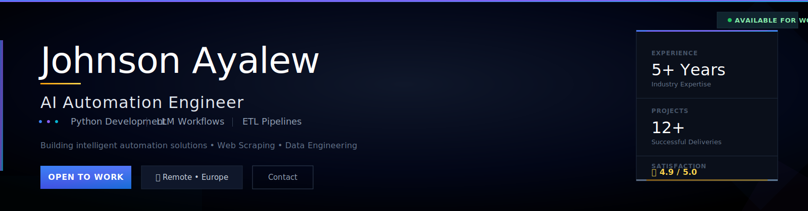

  

---

I build **AI-powered automation systems** that eliminate hours of manual work — scraping thousands of records, scoring them with LLMs, loading them into clean databases, and pushing results straight to Telegram, email, or a live dashboard. Every project ships with a real GUI, real data, and zero wasted clicks.

---

### Languages

### AI & APIs

### Backend & Data

### Frontend

### Scraping & Automation

---

### Specialties

---

### GitHub Stats

---

Open to full-time, contract, and sponsored positions · Remote or Europe

