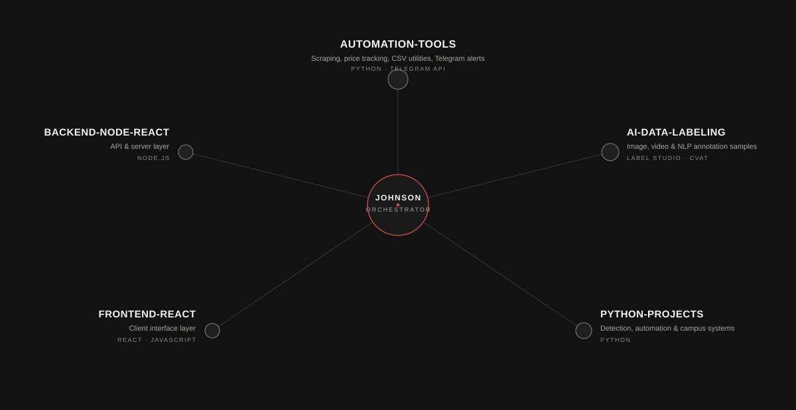
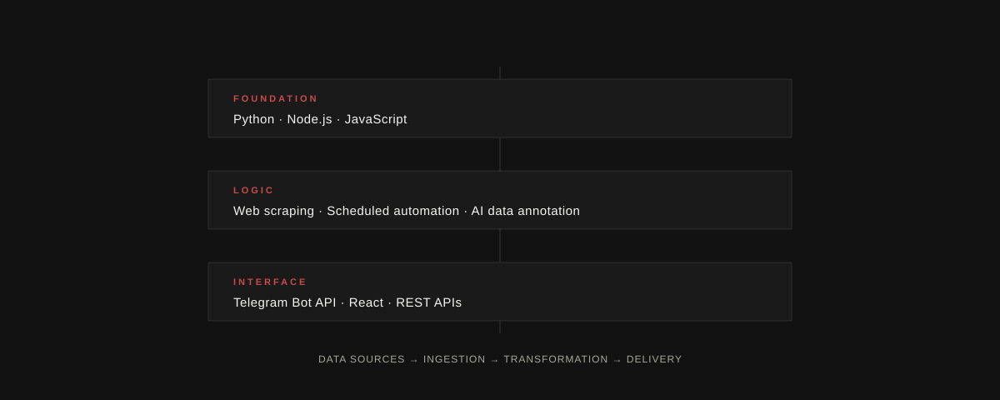

 

I design automation systems that turn complex, repetitive workflows into reliable processes.

  

Python · Automation · AI Data Annotation · React · Node.js

 

 

## What I Build

Not one-off scripts. Not CRUD templates. Systems that take a manual, repetitive workflow and quietly remove the manual part.

<table>
<tr>
<td width="33%" valign="top">

**Automation**

Web scraping, price tracking, CSV processing, and scheduled alerting — built as modular Python tools rather than one-time scripts.

</td>
<td width="33%" valign="top">

**AI Data Annotation**

Structured image, video, and text-labeling workflows using Label Studio and CVAT, built for consistency across large datasets.

</td>
<td width="33%" valign="top">

**Full-Stack Systems**

Python and Node.js services paired with React interfaces — the automation layer and the layer people actually see.

</td>
</tr>
</table>

 

 

## Systems

<table>
<tr>
<td width="50%" valign="top">

**[automation-tools](https://github.com/JhonsonAyalew/automation-tools)**
 Scrape → transform → notify, plus price tracking, CSV splitting, and Telegram reporting.
 Python · Telegram Bot API

</td>
<td width="50%" valign="top">

**[ai-data-labeling](https://github.com/JhonsonAyalew/ai-data-labeling)**
 Image, video, and NLP annotation samples across bounding box, segmentation, and entity-labeling workflows.
 Label Studio · CVAT

</td>
</tr>
<tr>
<td width="50%" valign="top">

**[python-projects](https://github.com/JhonsonAyalew/python-projects)**
 Detection, sales automation, and a smart university system — applied Python across different problem domains.
 Python

</td>
<td width="50%" valign="top">

**[backend-node-react](https://github.com/JhonsonAyalew/backend-node-react)** · **[frontend-react](https://github.com/JhonsonAyalew/frontend-react)**
 Paired service and interface layers for full-stack delivery.
 Node.js · React

</td>
</tr>
</table>

 

 

## Architecture

 

 

**[GitHub](https://github.com/JhonsonAyalew)** · **[LinkedIn](https://www.linkedin.com/in/jhonson-ayalew-a3738138b)** · **[Portfolio](https://portfolio-chi-seven-11.vercel.app)**

 
