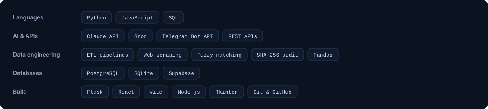

  

  [Email](mailto:JhonsonAyalew21@gmail.com) &nbsp;|&nbsp; [Portfolio](https://jhonson-ayalew.vercel.app) &nbsp;|&nbsp; [LinkedIn](https://linkedin.com/in/johnson-ayalew)

 

I build automation systems that replace manual work: scrapers, ETL pipelines, and LLM-powered tools using the Claude API and Groq. When a product needs a front end, I ship it with React and Flask. Over 2 years, I've delivered 5+ production systems for international clients.

## Selected work

<table>
<tr>
<td width="50%" valign="top">

**[MediaWire](https://github.com/JhonsonAyalew/MediaWire-Press-Intelligence-Desk)**
 Scrapes journalist contacts from CNBC, WIRED, AP News and CNET, scores them with Claude, and drafts personalized pitches in a React dashboard.
 Research time cut from hours to minutes.

</td>
<td width="50%" valign="top">

**[Media Intelligence Suite](https://github.com/JhonsonAyalew/media-intelligence-suite)**
 Six desktop apps for monitoring six major outlets, with email decoding, Sheets sync and deduplication.
 Automates work that normally takes a full team.

</td>
</tr>
<tr>
<td width="50%" valign="top">

**[CPA Data Pipeline](https://github.com/JhonsonAyalew/cpa-data-ingestion-pipeline)**
 Five-stage ETL for NASBA license records: parsing, normalization, fuzzy deduplication and chunked PostgreSQL import.
 100,000+ records, zero data loss.

</td>
<td width="50%" valign="top">

**[Ethiopian Jobs Bot](https://github.com/JhonsonAyalew/ethiopian-jobs-bot)**
 Aggregates local job listings, extracts qualifications with Groq, and posts curated results to Telegram.
 Runs fully on its own, 24/7.

</td>
</tr>
</table>

## Stack

## Experience

**Lead AI Automation Engineer & Python Developer**, Freelance (incl. Upwork) &nbsp;·&nbsp; 2023 to now
 Owned architecture, development and deployment of 5+ AI automation systems for international clients.

**Lead Full-Stack Developer (sole engineer)**, ConcreteRent &nbsp;·&nbsp; 2024
 Built ConcreteRent.com end to end in 12 months: React front end, Flask REST API, booking flow.

## Education

**BSc Computer Science**, Ambo University, 2021 to 2024, CGPA 3.68 / 4.00
 Scientific Computing with Python, freeCodeCamp

 

  <b>Open to full-time, contract and sponsored roles, remote or Europe.</b>
   I usually reply within 24 hours.

