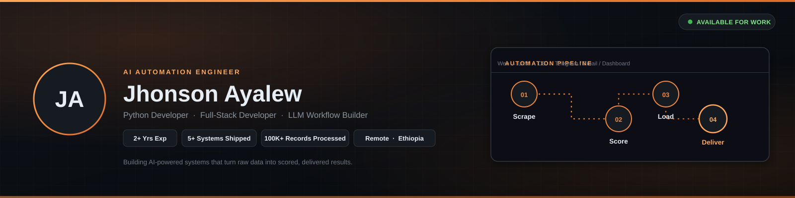

  

## About

Python Developer and AI Automation Engineer with 2+ years of experience building intelligent automation systems, ETL pipelines, and full-stack web applications. I've delivered 5+ production-ready projects integrating large language models — Claude API, Groq — that eliminate hours of manual work, with a strong foundation in data engineering, large-scale web scraping, and full-stack development using React and Flask.

<table align="center">
<tr>
<td align="center" width="25%"><b>2+</b> Years Experience</td>
<td align="center" width="25%"><b>5+</b> Production Systems</td>
<td align="center" width="25%"><b>100K+</b> Records Processed</td>
<td align="center" width="25%"><b>3.68</b> CGPA · BSc CS</td>
</tr>
</table>

## Tech Stack

<table>
<tr>
<td valign="top" width="50%">

**Languages**
 

**Frameworks**
 

</td>
<td valign="top" width="50%">

**AI & APIs**
 

**Data & Cloud**
 

**Data Engineering**
 

</td>
</tr>
</table>

## Specialties

<table>
<tr>
<td align="center" width="20%">
 
<b>Web Scraping at Scale</b>
</td>
<td align="center" width="20%">
 
<b>AI Scoring & Outreach</b>
</td>
<td align="center" width="20%">
 
<b>ETL Pipelines</b>
</td>
<td align="center" width="20%">
 
<b>Bot Automation</b>
</td>
<td align="center" width="20%">
 
<b>Desktop GUI Tools</b>
</td>
</tr>
</table>

## Experience

**Lead AI Automation Engineer & Python Developer** — Self-Employed / Freelance, incl. Upwork
 01/2023 – Present · Addis Ababa, Ethiopia (Remote)

- Directed end-to-end delivery of 5+ production AI automation systems for international clients, owning architecture, development, and deployment
- Engineered **MediaWire**, an AI press intelligence platform scraping journalist contacts from 4 major outlets, cutting manual PR research time by 90%
- Architected a 5-stage ETL pipeline processing 100,000+ CPA license records with Jaro-Winkler fuzzy deduplication, SHA-256 audit verification, and chunked PostgreSQL import — zero data loss
- Shipped a Media Intelligence Suite of 6 enterprise Tkinter desktop apps, automating a PR workflow that previously required a full team
- Automated a 24/7 Ethiopian jobs aggregator with Groq AI qualification extraction and Telegram Bot API posting

**Lead Full-Stack Developer (Sole Engineer)** — ConcreteRent
 01/2024 – 12/2024 · Remote (Contract)

- Owned design and delivery of ConcreteRent.com end-to-end across a 12-month solo build
- Built the full React frontend — equipment catalog, booking flow, mobile-responsive UI
- Implemented the Python/Flask backend with a REST API, database integration, and business logic

## Featured Projects

<table>
<tr>
<td width="50%" valign="top">

**[MediaWire — AI Press Intelligence Desk](https://github.com/JhonsonAyalew/MediaWire-Press-Intelligence-Desk)**
 Scrapes journalist contacts from CNBC, WIRED, AP News, and CNET, scores them with Claude AI, and auto-generates personalized pitch emails via a React dashboard.
 **Impact:** Research time cut from hours to minutes

</td>
<td width="50%" valign="top">

**[Media Intelligence Suite](https://github.com/JhonsonAyalew/media-intelligence-suite)**
 Six desktop apps for media monitoring across CNBC, Business Insider, AP News, CNET, The Verge, and WIRED, with email decoding, Sheets sync, and deduplication.
 **Impact:** Automated a workflow that normally needs a full team

</td>
</tr>
<tr>
<td width="50%" valign="top">

**[CPA Data Ingestion Pipeline](https://github.com/JhonsonAyalew/cpa-data-ingestion-pipeline)**
 5-stage ETL system for NASBA CPA license records — parsing, normalization, chunked PostgreSQL import, and fuzzy-match deduplication.
 **Impact:** 100,000+ records processed with zero data loss

</td>
<td width="50%" valign="top">

**[Ethiopian Jobs Aggregator Bot](https://github.com/JhonsonAyalew/ethiopian-jobs-bot)**
 Pulls listings from Ethiopian job platforms on a schedule, uses Groq AI to extract qualifications, deduplicates, and posts curated jobs to Telegram.
 **Impact:** Runs fully autonomously, 24/7

</td>
</tr>
</table>

## GitHub Stats

## Education & Certifications

**BSc, Computer Science** — Ambo University · 07/2021 – 07/2024 · CGPA 3.68 / 4.00

- Scientific Computing with Python — freeCodeCamp · 12/2024 – 05/2025
- Employment Skills & Job Readiness Training · 06/2024 – 07/2024

### Open to full-time, contract, and sponsored positions · Remote or Europe

Reach out via the links above — usually respond within 24 hours.

